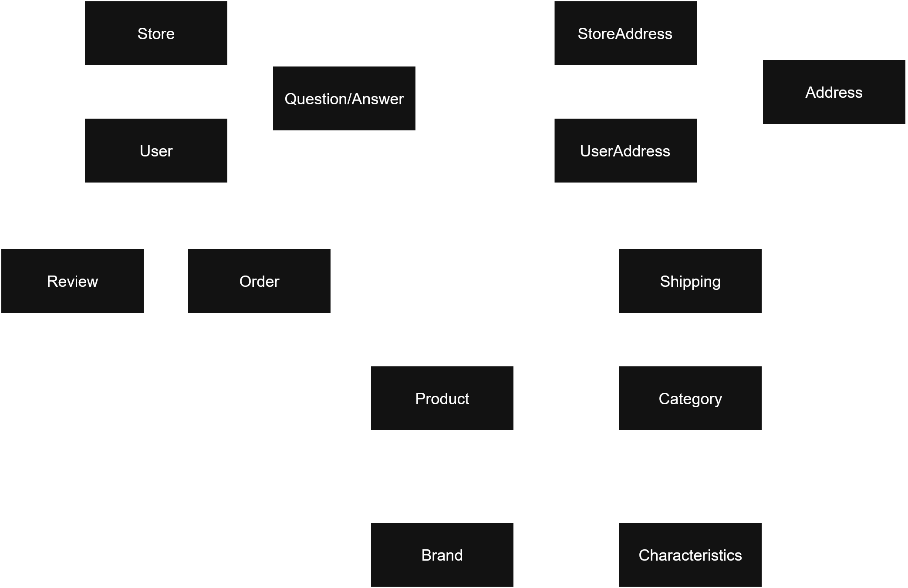

# Architecture Documentation

## Requirements, Domains and Entities

I started the project development from requirements analysis. To do this, I observed Mercado Livre's product pages and identified that a product has:
1. A seller (selling store)
2. A brand
3. Details:
   - title
   - description
   - photos/main photo
   - number of sales
   - price
   - stock
   - standardized characteristics by category
4. A category (which may be a child of another category)
5. Shipping between the store and the logged-in user's address
6. Product suggestions
7. Questions asked by users and answers by seller
8. Reviews

From this, I proceeded to identify business domains:
- Actors ([actor](../src/main/java/br/com/meli/technicalchallenge/model/domain/actor)): who acts on the system (buyer and seller);
- Product ([product](../src/main/java/br/com/meli/technicalchallenge/model/domain/product)): the product itself, along with its details;
- Pre-acquisition ([question](../src/main/java/br/com/meli/technicalchallenge/model/domain/question)): questions and answers that support the buyer's decision-making;
- Acquisition ([purchase](../src/main/java/br/com/meli/technicalchallenge/model/domain/purchase)): product purchase and payment;
- Shipping ([shipping](../src/main/java/br/com/meli/technicalchallenge/model/domain/shipping)): related to logistics for product delivery.

Thus, the resulting domain class composition can be expressed by the following diagram:

### Missing Features

Although the system structure is already complete and supports the implementation of every functionality, I chose to not implement all system functionalities due to time constraints — 8h-10h of development time, when the proposed development time was 5h —. What is implemented is a vertical slice of the system: the base product details fetching endpoint (`GET /api/products/{id}`).

The missing functionalities would have been implemented like the following:
1. Product Suggestions Endpoint (`GET /api/products/{id}/suggestions`)
- Would return 3 arrays containing:
  - IDs of the N highest-rated products from the same seller
  - IDs of the N highest-rated products from the same brand
  - IDs of the N highest-rated products from the same category

2. Questions and Answers Endpoint (`GET /api/products/{id}/questions`)
- Would return tuples of the N most recent questions and answers between users and seller
- Each tuple would contain the question, answer, public user info, and timestamps

3. Product Reviews Endpoint (`GET /api/products/{id}/reviews`)
- Would return the N most recent reviews
- Would include the overall product rating (calculated from the average of all reviews)
- Each review contains a rating, comment, public user info, and timestamp

## Design Decisions

### 1. Anemic Domain Models

Domain models use foreign key IDs exclusively, without embedded object references. As a direct consequence, the bulk of the business logic is contained inside the services instead of inside the models.

This choice was made because database must be simulated through JSON files, so JPA/Hibernate could not be used for ORM, and models need to be easily serialized/unserialized. Rich domain models could be implemented with proper association between entities, but this would mean that a custom ORM module would have to be implemented, which would require an excessive effort for this project.

### 2. Layered architecture and domain structure

A layered architecture and the classic controller-service-repository design were chosen because of their simplicity and because I have the most familiarity with them.

Controllers, Services, and Models are packaged within their domains.
Controllers and Services are domain-specific and Repositories are entity-specific: Controllers can only interact with their domain Service; Services can only interact with their domain Repositories and to other domain Services.

### 3. Null-safety through Optional

Since Java does not provide nullability at the type system level, it is conventionally agreed that when a function can return a null value, it should return it wrapped in an `Optional`. In addition, `NullPointerExceptions` are safely handled through the exception module (see below).

### 4. Exception Handling

Exception handling is done through the `MeLiException` base class and the `GlobalExceptionHandler`.

The `MeLiException` class provides a base structure to convert any exception thrown inside the system, logging the exception trace and mapping it to a related request response. It also takes safety into account, providing a way to avoid exposing sensitive information.

When exceptions are not explicitly handled within their logic blocks, they are handled through the `GlobalExceptionHandler`, which:
1. Converts unhandled exceptions into a `MeLiException`;
2. Extracts the response object from the converted `MeLiException` and returns the request response with it.

### 5. Testing

The tests are divided into two modules: unit tests and integration tests.
Because testing is time-consuming and due to the task’s time constraints, coverage is low, and mostly happy-path testing was performed. However, repository-layer tests are more comprehensive, due to the abstraction created through `BaseJsonRepository`, which required more thorough validation of data persistence and retrieval logic.
